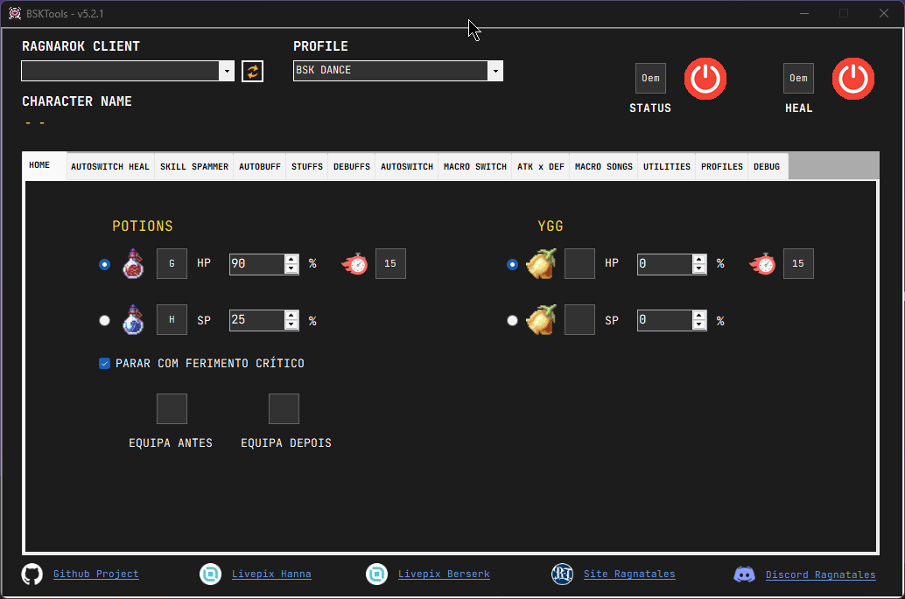

# BSKTools

> Ferramenta de automação para Ragnarok Online — focada no servidor **Ragna Tales**.  
> Fork do [TalesTools](https://github.com/biancaazuma/TalesTools) com melhorias, novos sistemas e correções de bugs.



---

## Download

Acesse a [página de releases](https://github.com/bsk-iT/TalesTools/releases) e baixe a versão mais recente.

Extraia o `.zip` e execute o `BSKTools.exe` **como administrador**.

---

## Funcionalidades

| Módulo | Descrição |
|---|---|
| **Autopot** | Usa poções de HP/SP automaticamente ao atingir um percentual configurável |
| **AutoBuff Skills** | Reaplica habilidades de buff automaticamente ao expirarem |
| **AutoBuff Stuffs** | Reaplica itens consumíveis de buff (comidas, poções, pergaminhos) |
| **AutoSwitch** | Troca de equipamentos/pets com base em buffs ativos — máquina de estados determinística |
| **AutoSwitch Heal** | Troca automática para equipamento de cura |
| **Rédea Automática** | Monta/desmonta automaticamente após percorrer uma quantidade configurável de células |
| **Macro Song** | Automação de sequências de habilidades de Bardo/Dançarina |
| **AHK (Spammer)** | Spam de skill com delay customizável |
| **ATK/DEF Mode** | Alterna perfis de equipamento entre modo ofensivo e defensivo |
| **AutoConnect** | Conecta automaticamente ao processo `rtales.bin` ao abrir o programa |
| **Tema Escuro** | Interface com dark mode em todos os formulários |
| **Debug Window** | Janela de depuração para monitorar estado interno em tempo real |

---

## Como usar

### Requisitos
- Windows 10 ou superior
- [Ragna Tales](https://ragnatales.com.br/) instalado e aberto
- .NET Framework 4.7.2 (já incluso no Windows 10+)

### Primeiros passos

1. Execute `BSKTools.exe` como **administrador**
2. O programa conecta automaticamente ao processo do jogo
3. Selecione ou crie um **perfil** no menu lateral
4. Configure cada módulo nas abas disponíveis
5. Pressione **F11** (padrão) para ligar/desligar tudo sem sair do jogo

---

## Usar em outros servidores de Ragnarok

O BSKTools lê diretamente a memória do cliente do jogo para obter HP, SP, mapa e posição do personagem. Cada servidor ou cliente usa endereços de memória diferentes.

Na **primeira execução**, o programa gera automaticamente o arquivo `supported_servers.json` na mesma pasta do executável.

### Estrutura do arquivo

```json
[
  {
    "name": "rtales.bin",
    "description": "Ragna Tales",
    "hpAddress": "0x015874D0",
    "nameAddress": "0x0158A120",
    "mapAddress": "0x01583574",
    "x_pos_offset": "0x0156FD4C",
    "entity_list_offset": "0x00D9FE2C"
  }
]
```

### Como adaptar para outro servidor

1. Abra o `supported_servers.json` com qualquer editor de texto (Notepad, VS Code, etc.)
2. **Para trocar** o servidor existente: altere o `name` (nome do `.exe` do cliente), `description` e os endereços de memória
3. **Para adicionar** um novo servidor sem remover o atual: adicione um novo objeto dentro do array `[...]`, separado por vírgula
4. Salve o arquivo e reinicie o BSKTools — o novo servidor aparecerá na lista de seleção

> **Como encontrar os endereços de memória:** use ferramentas como o **Cheat Engine** para encontrar os offsets de HP, nome do personagem, mapa atual e posição X no processo do cliente do seu servidor. Esses valores costumam mudar a cada atualização do cliente do jogo.

---

## Changelog

### v5.2.1
- Correção completa do AutoSwitch: máquina de estados com 3 estados (IDLE → SKILL_USED → BUFF_ACTIVE)
- Correção de 6 bugs no sistema de pet skills (troca prematura, loop, após morte, NullReference, etc.)
- Sistema de rastreamento de teclas físicas via KeyboardHook para detectar acionamento manual

### v5.2.0
- 129+ habilidades organizadas em ordem alfabética por classe
- 7 novas skills de Archer adicionadas (Assovio, Beijo da Sorte, Holofote, Sibilo, etc.)
- Novos IDs mapeados (VIP, Anel do Treinador, Flecha Dourada, Força Heróica, etc.)
- Poção do Leviathan adicionada ao AutoBuff Stuffs

### v5.1.0
- Rédea Automática (AutoRein): monta/desmonta com base em quantidade de células percorridas
- AutoConnect: conecta automaticamente ao processo `rtales.bin` ao iniciar o programa
- 9 novos debuffs com ícones (blind, frozen, fear, crystallization, sleep, stone, undead, etc.)
- Tema escuro completo em todos os formulários
- Opção "Pausar Tools com chat aberto"
- Correções em ConfigForm, MacroSongForm, Profile e AutobuffSkill

> Veja o [CHANGELOG completo](CHANGELOG.md) para detalhes técnicos de cada versão.

---

## Créditos

- **BSKTools** — fork e melhorias por [bsk-iT](https://github.com/bsk-iT)
- **TalesTools** — projeto original por [Bianca Azuma](https://github.com/biancaazuma/TalesTools) e [Hannamori](https://livepix.gg/hannamori)
- Servidor: [Ragna Tales](https://ragnatales.com.br/)

---

## Aviso

Este projeto é feito para uso pessoal. Use com responsabilidade e siga as regras do servidor.
